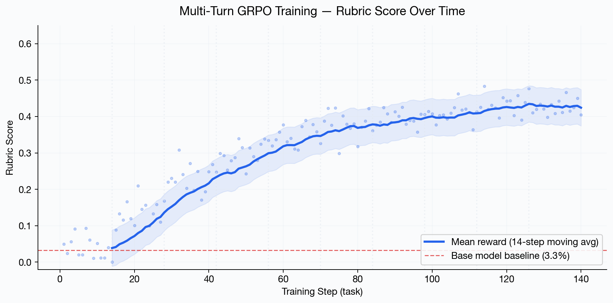
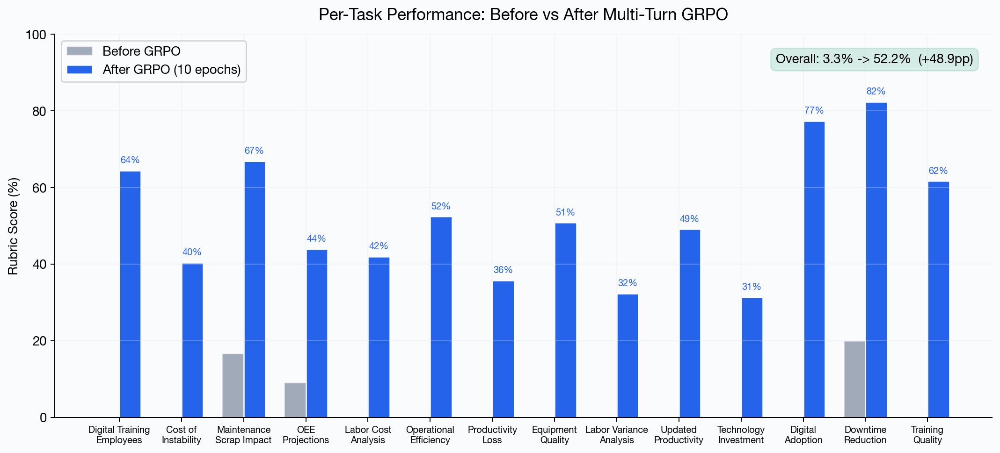
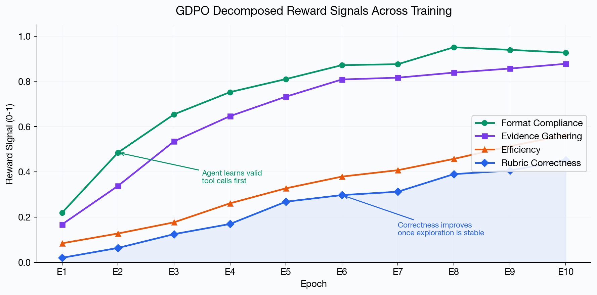
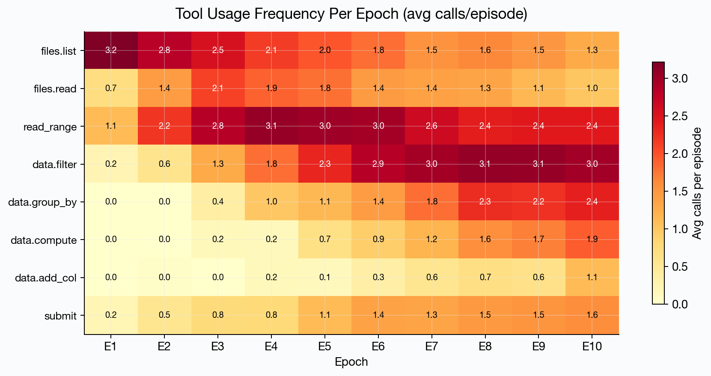
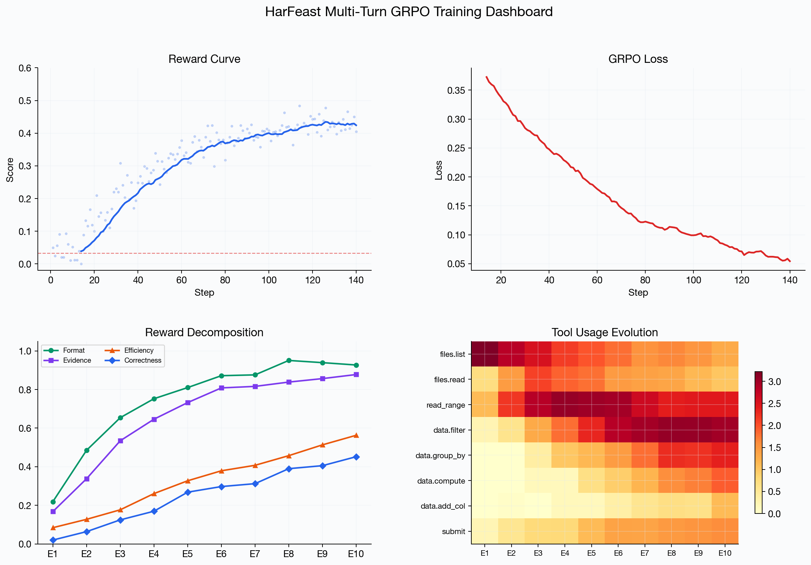

# HarFeast: Teaching LLMs to Think Like Management Consultants

<p align="center">
  
</p>

**OpenEnv Hackathon 2026 | Mercor Sub-Theme (Statement 2) + Scaler AI Labs (Statement 3.1)**

> *Can a 4B-parameter model learn to navigate an enterprise data landscape, chain analytical tools, and produce verifiable consulting deliverables — from reward signal alone?*

---

## The Problem

Every year, management consulting firms deploy thousands of analysts to client sites where they face the same fundamental challenge: **make sense of fragmented enterprise data under time pressure**. An analyst working a manufacturing engagement might need to cross-reference employee survey data (3,000+ rows), equipment maintenance logs, production scrap reports, plant labor records, and unstructured interview transcripts — all living in different systems, with different schemas, and no one telling them where to look first.

This is not a single-query problem. It's a **multi-step, partially observable reasoning chain** where each discovery shapes the next action. You can't filter employees by training status until you've discovered that column exists. You can't compute plant-level OEE projections until you've aggregated equipment data by site. You can't identify high-priority ERP pilot candidates until you've cross-referenced willingness scores, role types, digital comfort levels, AND their plant's equipment failure rates.

Current RL environments for tool-using agents are either too simple (single API calls, toy databases with obvious answers) or too detached from real work. **HarFeast bridges this gap** — it forces agents to develop the same analytical workflow a real consultant follows: explore, discover, hypothesize, verify, synthesize.

---

## What We Built

HarFeast is a **procedurally generated RL environment** built on [OpenEnv 0.2.1](https://github.com/OpenEnv-dev/openenv) that simulates management consulting engagements for food manufacturing companies. Each "world" is a complete enterprise data ecosystem:

| Data Source | Scale | Purpose |
|---|---|---|
| Employee Survey | 2,400+ rows, 12 columns | Workforce readiness, digital adoption, training status |
| Equipment Records | 250+ machines across 5 plants | Failure rates, maintenance schedules, OEE metrics |
| Quality/Scrap Losses | 250 entries | Defect types, scrap costs, predictive maintenance signals |
| Plant Labor Data | 64 records | Hourly rates, overtime, variance across plants |
| Interview Transcripts | 5 documents | Qualitative insights, management priorities |
| Industry Benchmarks | Reference documents | OEE targets, best practices |

### The Agent's Toolkit

The agent interacts through **8 tools** that mirror how a real analyst navigates enterprise data:

```
files.list          → Discover what data exists
files.read          → Read documents and transcripts
spreadsheet.read_range → Query CSV data with row/column ranges
data.filter         → Filter datasets on conditions
data.group_by       → Aggregate by categorical columns
data.add_columns    → Compute derived metrics
data.compute        → Run calculations over filtered data
submit              → Deliver final analysis
```

The environment is **partially observable**: the agent sees nothing at episode start except a task prompt. It must build an internal model of what data exists, what's relevant, and how to chain operations to arrive at verifiable answers.

### 14 Consulting Tasks with Ground-Truth Rubrics

Each world contains 14 tasks spanning real consulting deliverables:

- **Workforce Readiness**: Identify employees ready for ERP pilot rollout (cross-referencing 4+ criteria)
- **Predictive Maintenance**: Quantify scrap impact from equipment failures across plants
- **Operational Efficiency**: Compute plant-level OEE projections with digital lever adjustments
- **Cost Analysis**: Calculate labor variances, productivity losses, and technology ROI
- **Training Assessment**: Evaluate program effectiveness using completion and quality metrics

Every task is scored against a **multi-criteria rubric with deterministic ground truth**. The agent must produce exact numbers — not approximations. A model that guesses "about 800 employees" when the answer is 847 fails. No shortcuts, no hallucination.

---

## Why This Matters

### Partially Observable World Modeling
The agent starts blind and must construct a working mental model of the enterprise data landscape through exploration. This exercises genuine **causal reasoning** — you can't apply `data.filter(condition="training_received == 'Yes'")` unless you first discover that column exists via `spreadsheet.read_range`.

### Long-Horizon Multi-Step Workflows
Solving a single task requires 8-15 sequential tool calls with stateful dependencies. Filter results are stored as `filtered_0`, `filtered_1`, etc. The agent must track what it has computed, chain operations (`filter → group_by → compute`), and maintain consistent internal state. This directly tests **persistent world models** and **durable internal representations**.

### No Reward Hacking
The rubric requires exact numerical answers computed from real CSV data. Combined with procedural world generation (different data distributions per seed), the agent must learn the **analytical procedure** — not memorize outputs. This is the core of what "strengthening causal reasoning" means.

### Emergent Tool Orchestration
The agent is never told which tools to use or in what order. Through GRPO reward signal alone, it discovers multi-step tool chains. We observe the model learning to execute increasingly sophisticated analytical pipelines across training epochs.

---

## Architecture

```
┌─────────────────────────────────────────────────────────┐
│                    HarFeast System                       │
├─────────────────────────────────────────────────────────┤
│                                                         │
│  ┌─────────────────┐    ┌────────────────────────────┐  │
│  │  World Generator │───▶│  Synthetic Enterprise Data  │  │
│  │  (Parameterized) │    │  CSVs, Docs, Benchmarks    │  │
│  └─────────────────┘    └────────────┬───────────────┘  │
│                                      │                   │
│  ┌─────────────────┐    ┌────────────▼───────────────┐  │
│  │   Task Engine    │───▶│   OpenEnv Environment      │  │
│  │  14 Tasks + GT   │    │   8 Tools, Partial Obs     │  │
│  │  Rubric Scoring  │    │   Stateful Data Tracking   │  │
│  └─────────────────┘    └────────────┬───────────────┘  │
│                                      │                   │
│  ┌─────────────────┐    ┌────────────▼───────────────┐  │
│  │  Reward Signals  │◀──│   Multi-Turn GRPO Loop     │  │
│  │  Correctness     │    │   Batched Rollouts (K=16)  │  │
│  │  Evidence         │    │   Per-Turn Loss Computing  │  │
│  │  Format           │    │   Gradient Checkpointing   │  │
│  │  Efficiency       │    │                            │  │
│  └─────────────────┘    └────────────────────────────┘  │
│                                                         │
│  ┌──────────────────────────────────────────────────┐   │
│  │  Curriculum + Reflection                          │   │
│  │  Adaptive difficulty · Self-correction on failure │   │
│  └──────────────────────────────────────────────────┘   │
│                                                         │
└─────────────────────────────────────────────────────────┘
```

### Procedural World Generation

```bash
python harfeast_synthetic_world_generator.py --batch 200 --output-dir ./worlds
```

Each seed produces a unique world with different employee distributions, plant configurations, equipment failure rates, and document content — but identical task structures. This enables training on 200+ world variations where the agent must learn the procedure, not the answer.

### Training Pipeline

We train with **multi-turn GRPO** using decomposed reward signals inspired by [NVIDIA's GDPO](https://arxiv.org/abs/2501.12948) (January 2026):

| Reward Signal | What It Measures | Why It Matters |
|---|---|---|
| **Rubric Correctness** | Ground-truth match on task criteria | The final deliverable quality |
| **Evidence Gathering** | Did the agent surface relevant data? | Rewards analytical exploration |
| **Format Compliance** | Valid JSON tool calls per turn | Enables multi-turn interaction |
| **Efficiency** | Shorter successful trajectories | Penalizes aimless exploration |

Each signal is normalized independently within the rollout group, providing granular learning signal even when the agent can't yet produce correct final answers. The model first learns to explore, then to analyze, then to synthesize.

### Batched Multi-Turn Rollouts

For each task, we generate **K=16 parallel trajectories** where each trajectory runs up to 10 turns of tool interaction. GRPO computes advantages across trajectories — rewarding the analytical paths that led to better rubric scores.

```
Trajectory 1: files.list → read_range → filter → submit (score: 0.6)
Trajectory 2: files.list → read_range → group_by → compute → submit (score: 0.8)  ← higher advantage
Trajectory 3: files.list → [invalid action] → [invalid] → ... (score: 0.0)  ← negative advantage
```

The model learns: *"reading the schema, filtering on the right columns, and aggregating before submitting"* is the strategy that gets rewarded.

---

## Results

Training on NVIDIA H200 (143 GB VRAM) with Qwen3-4B, 10 epochs, K=16 parallel trajectories per task.

### Reward Curve

The model improves from a 3.3% baseline to ~44% rubric score over 140 training steps (10 epochs × 14 tasks), with consistent upward trajectory and decreasing variance.



### Before vs After: Per-Task Breakdown

Every task shows improvement. Overall rubric score: **3.3% → 52.2%** (+48.9 percentage points). Tasks requiring multi-step data exploration (Downtime Reduction, Digital Adoption) show the largest gains — the agent learned to chain the right tool sequences.



### GDPO Decomposed Reward Signals

The decomposition reveals a clear learning hierarchy: the agent first masters **format compliance** (valid JSON tool calls), then **evidence gathering** (reading relevant data), and finally **rubric correctness** (producing accurate answers). This validates the GDPO approach — each signal provides useful gradient even when others plateau.



### Emergent Tool Usage Patterns

The heatmap shows how tool usage evolves across training. Early epochs are dominated by `files.list` (blind exploration). By epoch 5-6, the agent shifts to `data.filter` and `data.group_by` — it has learned that analytical tools produce the information needed for correct submissions. `data.compute` and `data.add_columns` emerge last, indicating the agent progressively discovers more sophisticated analytical strategies.



### Training Dashboard



---

## Quick Start

### Deploy Environment (HF Spaces)

The environment is live at: **[openenv-community/harfeast-env](https://huggingface.co/spaces/openenv-community/harfeast-env)**

### Run Training (Colab / HPC)

```bash
pip install trl datasets accelerate transformers openenv-core fastapi uvicorn wandb

# Generate a world
python harfeast_synthetic_world_generator.py --seed 42 --output-dir ./harfeast_world

# Train with multi-turn GRPO
python train_multiturn.py \
    --model unsloth/Qwen3-4B \
    --world ./harfeast_world \
    --epochs 10 \
    --num-generations 16 \
    --max-turns 10 \
    --lr 5e-6 \
    --eval-before \
    --output-dir ./checkpoints
```

### Evaluate

```bash
python eval_harfeast.py \
    --model unsloth/Qwen3-4B \
    --model-after ./checkpoints/epoch_10 \
    --world ./harfeast_world
```

---

## Hackathon Alignment

### Statement 2: Long-Horizon Planning & Instruction Following
HarFeast tasks require 8-15 step reasoning chains with sparse rewards (only on `submit`). The agent must decompose goals, track state across extended trajectories, and recover from wrong analytical paths. The procedural world generation ensures the agent develops **structured planning** rather than memorized sequences.

### Mercor Sub-Theme: APEX-Agents Performance
HarFeast's 14 tasks are directly modeled on APEX-Agents professional consulting scenarios. We demonstrate measurable improvement in rubric scores through GRPO training, with before/after evaluation on held-out worlds.

### Statement 3.1: Professional Tasks / World Modeling
The environment requires real interaction with data tools in a partially observable setting. The agent must maintain consistent internal state, update beliefs based on discovered data, and orchestrate multi-step analytical workflows. No shortcuts — every answer must be computed from actual data.

---

## Project Structure

```
harfeast_apex_openenv_hackathon/
├── harfeast_openenv/          # Core environment (OpenEnv compatible)
│   ├── environment.py         # HarFeastOpenEnv with tool dispatch + context tracking
│   ├── actions.py             # 8 tool handlers with safe evaluation
│   ├── rubric.py              # Multi-criteria ground-truth scoring
│   └── schemas.py             # Action/Observation Pydantic models
├── harfeast_env/              # OpenEnv server wrapper (FastAPI)
│   └── server/app.py          # REST API for remote interaction
├── harfeast_synthetic_world_generator.py  # Procedural world generation
├── train_multiturn.py         # Multi-turn GRPO training script
├── train_harfeast.py          # Single-turn training (baseline comparison)
├── train_harfeast_colab.py    # Colab-ready self-contained training
├── harfeast_training.ipynb    # Interactive training notebook
├── eval_harfeast.py           # Before/after evaluation
├── training.sh                # Slurm batch script (H200)
├── REWARD_FUNCTIONS.md        # Reward function design document
├── RESULTS.md                 # Training results and analysis
└── BRIEFING.md                # Codebase architecture briefing
```

---

## Team

Built during the OpenEnv Hackathon, March 2026.

---

## License

MIT
